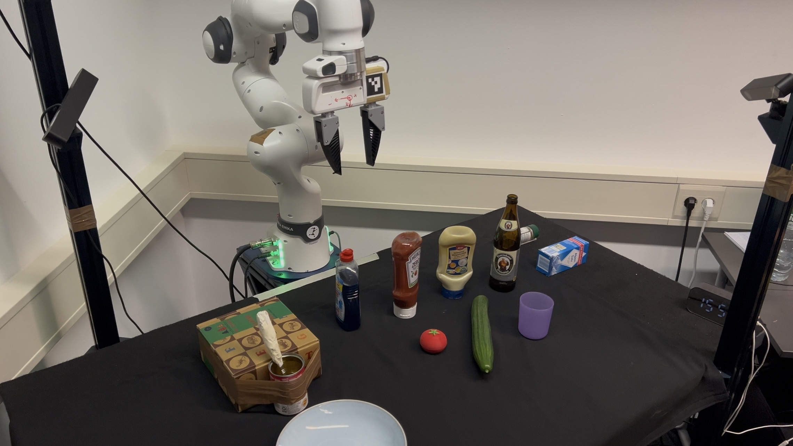

# Mosaic

Inspired from the paper: https://portal-cornell.github.io/MOSAIC/, the project's target is to use different interaction methods, e.g. voice command, gesture and gaze from the user, as well as the reasoning capability from LLM and VLM to achieve generalized task planning for various kinds of objects in a hierachical manner. 

<!--  -->

<p align="center">
  
</p>
<p align="center"><em>Fig. 1  Workspace overview</em></p>

Our code is divided into two parts: high level and low level(manipulation_ws). For detailed high level structure please check the README.md inside `./high_level` folder. low level part contains the motions that we need to use Franka's Panda robot arm for this task, which is developed with ROS2 humble. 

## 🔧 Installation guide


1. **Install system dependencies(for Ubuntu 22.04)**  
   ```bash
   sudo apt update
   sudo apt install portaudio19-dev python3-dev pulseaudio pulseaudio-utils
   ```

2. **Build ros2 packages**
   ```bash
   cd manipulation_ws
   source /opt/ros/humble/setup.bash
   colcon build
   ```

2. **Install Python dependencies**  
   ```bash
   conda create -n mosaic python=3.10
   conda activate mosaic
   pip install -r requirements.txt
   ```

3. **Set environment variables**  
   Add the following lines to `~/.bashrc`, `~/.zshrc` or `~/.config/fish/config.fish`:  
   ```bash
   export MISTRAL_API_KEY="your_mistral_api_key_here"
   ```
   or
   ```bash
   export OPENAI_API_KEY="your_openai_api_key_here"
   ```

4. **Model source**
   ```
   high_level/src/VLM_agent/sam_hq/sam_vit_h_4b8939.pth: 
   https://huggingface.co/HCMUE-Research/SAM-vit-h/blob/main/sam_vit_h_4b8939.pth

   high_level/src/VLM_agent/FastSAM/FastSAM-x.pt:
   https://github.com/ultralytics/assets/releases/download/v8.3.0/FastSAM-x.pt
   ```

## Run the demo
```bash
chmod +x launch.sh
./launch.sh
```


